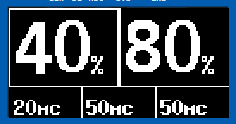
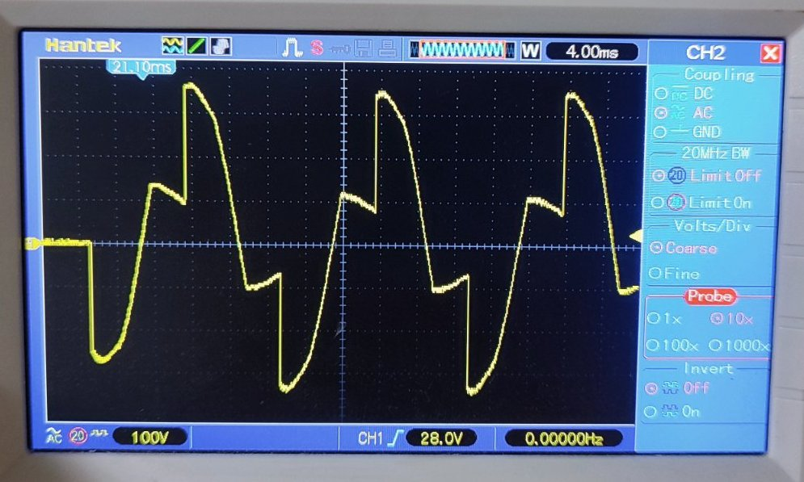
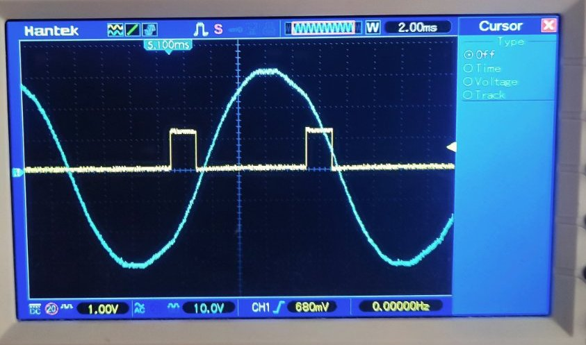

# SyncPulse

**SyncPulse** — это прошивка для микроконтроллеров Arduino (Atmel AVR), предназначенная для управления прецизионной контактной сваркой на базе симисторов (TRIAC). Проект реализует фазовое управление мощностью с жесткой синхронизацией по переходу сетевого напряжения через ноль (Zero-Crossing).

## Благодарности и ссылки
Данный проект основан на коде для контроллера точечной сварки, авторство которого принадлежит пользователю **yurok** с сайта [MySKU.club](https://mysku.club/blog/aliexpress/45329.html#comment4754513). 
Благодарю автора за базу для реализации логики управления импульсами. 

Моя версия проекта (SyncPulse) была глубоко переработана для повышения надежности, оптимизации работы с таймингами и внедрения современного интерфейса.

## Основные возможности

*   **Фазовое управление:** Плавная регулировка мощности (от 30% до 99%) для обоих сварочных импульсов.
*   **Динамическая длительность импульса:** Автоматическая настройка ширины управляющего импульса (1мс / 2мс) для снижения нагрева управляющей цепи.
*   **Синхронизация Zero-Cross:** Высокоточная привязка начала сварки к фазе сети для исключения бросков тока и защиты оборудования.
*   **Гибкий алгоритм сварки:** Поддержка цикла: `Предварительный импульс` -> `Пауза` -> `Основной импульс`.
*   **Интерфейс:** Управление через OLED-дисплей 128x64 и энкодер с кастомизированной логикой шага (2 физических щелчка = 1 программный шаг).
*   **Память:** Сохранение профилей настроек в EEPROM (до 5 ячеек).
*   **Защита:** Мониторинг сигнала детектора нуля и защита от некорректных запусков.

---

## 🖥 Интерфейс и Меню
Главный экран устройства спроектирован для мгновенного считывания настроек сварки. Интерфейс разделен на два функциональных сектора:

### 1. Сектор мощности (Два больших поля)
Это основные параметры интенсивности нагрева. Они отображаются крупным шрифтом для удобства настройки «на лету».
*   **Левое поле:** Мощность предварительного импульса (Pre-Power, %).
*   **Правое поле:** Мощность основного сварочного импульса (Main-Power, %).
*   *Настройка:* Плавная регулировка от 30% до 99% позволяет подобрать оптимальный режим как для тонких листов, так и для более толстых заготовок. Шаг регулировки 5%.

### 2. Сектор времени (Три малых поля)
В нижней части экрана располагаются три параметра, определяющие временную диаграмму процесса:
*   **Длительность прогрева:** Время воздействия первого импульса.
*   **Пауза:** Время «остывания» между импульсами.
*   **Длительность сварки:** Время воздействия второго (основного) импульса.

> **Инженерное решение:** Шаг изменения времени составляет ровно **20 мс**. Это не ограничение, а защита. При частоте сети 50 Гц период составляет 20 мс. Соблюдение этого шага гарантирует, что каждый импульс состоит из целого числа периодов (полных положительных и отрицательных полуволн). Это предотвращает появление постоянной составляющей (DC) тока, которая может вызвать насыщение сердечника сварочного трансформатора и его перегрев.

---

## ⚙️ Системные настройки и калибровка
Для входа в системное меню удерживайте кнопку энкодера **1 секунду** на главном экране.

*   **Пресеты:** Сохранение и загрузка параметров в одну из 5 ячеек EEPROM.
*   **Zero-Cross Shift (Калибровка фазы):** 
    Настройка необходима для компенсации задержки обработки сигнала микроконтроллером и точного переноса старта импульса на начало следующей полуволны.
    
    **Процедура калибровки:**
    1. **Подключение:** Подключите осциллограф: щуп 1 — к светодиоду оптопары (управление), щуп 2 — через понижающий трансформатор к сети 230V для контроля фазы (50 Гц).
    2. **Настройка:** Установите на осциллографе запуск (trigger) по сигналу на оптопаре.
    3. **Параметры:** Выставьте в меню мощность **30%** (длительность импульса составит 1 мс).
    4. **Замер:** Произведите запуск сварки (педалью).
    5. **Результат:** Регулируйте параметр `Zero-Cross Shift` так, чтобы интервал между окончанием управляющего импульса и следующим переходом сетевой синусоиды через ноль составлял ровно **2 мс**.

---
## 🔌 Логика работы

1.  **Фазовая задержка:** Прошивка использует `map(power, 30, 99, 7000, 500)`, где 7000 мкс — минимальная мощность, а 500 мкс — максимальная.
2.  **Динамический импульс:** Если мощность менее 50%, длительность управляющего импульса на симистор составляет 1 мс, если 50% и выше — 2 мс.
3.  **Безопасность:** Если при нажатии педали амплитуда сигнала детектора нуля недостаточна, система блокирует сварку и выводит экран `ОШИБКА`, предотвращая возможный пробой симистора.

---

## 🔌 Аппаратная конфигурация (Pinout)
Прошивка настроена для работы на Arduino Nano / Uno со следующей распиновкой:

| Функция | Пин (Arduino) | Описание |
| :--- | :---: | :--- |
| **Симистор (Triac)** | D10 | Управление мощностью (PWM/Phase) |
| **Детектор нуля (Z-Cross)** | A6 | Вход сигнала синхронизации фазы |
| **Педаль запуска** | D8 | Кнопка инициации сварки |
| **Вентилятор** | D9 | Охлаждение радиатора |
| **Энкодер A** | D3 | Канал А (прерывание INT1) |
| **Энкодер B** | D2 | Канал B |
| **Кнопка энкодера** | D4 | Навигация по меню |
| **Зуммер (Beeper)** | D5 | Звуковая индикация |
| **LED Green/Blue** | D6 / D7 | Индикация режимов работы |

## 🕹 Управление
*   **Вращение энкодера:** Изменение значений параметров.
*   **Короткое нажатие:** Переключение между полями / Вход в меню / Выбор действия.
*   **Длинное нажатие (1 сек):** Вход в системное меню настроек.

## 🛠 Установка
1. Подключите все компоненты согласно таблице Pinout.
2. Откройте `SyncPulse.ino` в Arduino IDE.
3. Убедитесь, что установлена библиотека `U8glib`.
4. Скомпилируйте и загрузите прошивку в контроллер.

## ⚠️ Предупреждение о безопасности
Данный проект работает с **высоким напряжением 230V AC**.
*   Все силовые цепи должны быть гальванически развязаны от управляющей логики (используйте оптосимисторы, например, MOC3023).
*   Соблюдайте правила техники безопасности при работе с электросетью.
*   Автор не несет ответственности за порчу оборудования или травмы, полученные при неправильной сборке схемы.

## ⚖️ Лицензия
Проект распространяется по лицензии MIT. Вы можете свободно использовать, изменять и дополнять данный код.
